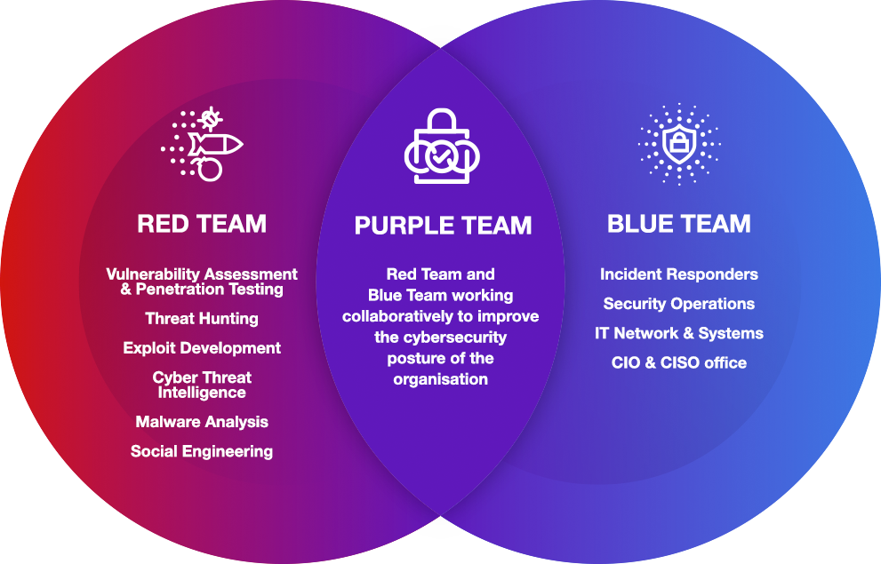
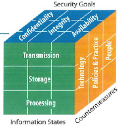
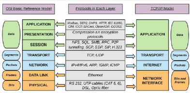
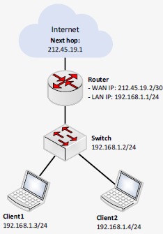
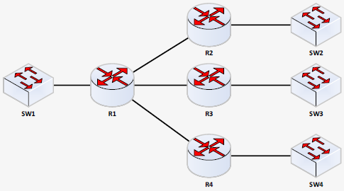
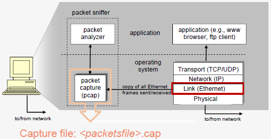

# H1 - network sniffing

## 1.1. Introductie

### Red or blue
Red team: aanvallen → zoeken kwetsbaarheden in systeem (bv penetration testing)  
Blue team: verdediging → lossen kwetsbaarheden op (bv met firewalls, 2FA, patches, ...)  
Purple team: combinatie van beide  

### Cybersecurity kubus - McCumber Cube
3 dimensies → 3\*3\*3 = 27 combinaties
- Beveiligingsprincipes (CIA)
  - Confidentiality, Integrity, Availability
- Staten van data
  - Storage (opgeslagen), Transmission (onderweg), Processing (typisch in RAM)
- Beveiligingsmaatregelen
  - Technology, Policies & Practive, People

### Fasen van een aanval - RSGMC
1. Reconnaissance: info verzamelen, passief (=geen direct contact) of actief (=direct contact)
2. Scanning and enumeration: zoeken naar zwakke punten (port/network/vulnerability scanning)
3. Gaining access: effectieve aanval om toegang te krijgen tot organisatie (logingegevens ontfutselen, exploits misbruiken, wachtwoorden kraken, ...)
4. Maintaining access: toegang behouden (rootkit, backdoor)
5. Covering tracks: alle sporen uitwissen (wissen entries logbestanden, ...)

 
\pagebreak 

### OSI en TCP/IP model - CCNA1
OSI
- 7 lagen: tussen fysiek en applicatielaag
- Als 2 applicaties communiceren: bericht van de zender tot onderste laag, versturen, terug naar boven
- Elke laag: headers en trailers

TCP/IP: implementatie van OSI  
- 4 of 5 lagen
- Namen van pakketten
  - Transportlaag: segmenten
  - Internetlaag: pakketten
  - Netwerk-interfacelaag: bits en frames

### Afluisteren van netwerkverkeer
- In Kubus
  - CIA: confidentiality
  - Staat van data: in beweging
- Fase van aanval: 3 (gaining access)
- Laag van OSI/TCP-IP: 2 (Data link - ethernet)

 
\pagebreak 

## 1.2. IP netwerken

### Verschil router, switch en hub
||Hub|Switch|Router|
|:--|:--|:--|:--|
|**Functie**|Bits, doorsturen op elke interface|Frames, intelligente selectie interface op basis van MAC-adres|IP-pakketten, doorsturen naar ander netwerk op basis IP-adres|
|**Bereik**|Binnen 1 (sub)netwerk|Binnen 1 (sub)netwerk|Koppeling tussen verschillende (sub)netwerken|
|**OSI**|Layer 1|Layer 2|Layer 3|
|**Persistentie**|Geen|MAC lookup table|Routing table|
|**Voorstelling**||||

### IP configuratie
In IPv4 netwerk
- IPv4 adres (xxx.xxx.xxx.xxx)
- Subnetmask
- (opt) Default gateway
- (opt) IP adressen DNS-server(s)

**Voorbeeld**  

||WAN|LAN|
|:--|:--|:--|
|**IP-adres**|212.45.19.2|192.168.1.1|
|**Subnet mask**|255.255.255.252|255.255.255.0|
|**Default gateway**|212.45.19.1|/|

 
\pagebreak 

### Subnetting

→ 7 subnetten  
 
Op linux: ipcalc xxx.xxx.xxx.xxx geeft adressen, subnet masks, ...

## 1.3. Afluisten van netwerkverkeer

### Populaire sniffing tools
TCPdump
- Op cmd: tcpdump -a
- Gebruikt libpcap
- Voor unix-gebaseerden: Linux, Mac
- Windows: WinDump (met WinPcap)

Wireshark
- GUI
- Gebruikt cap
- Zowel UNIX als Windows

### Pcap files
- Resultaat van network sniffer → latere analyse
- Extensie: .pcap, .cap, .dmp

