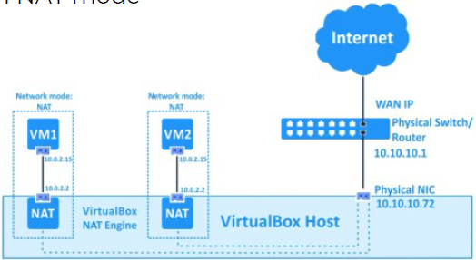
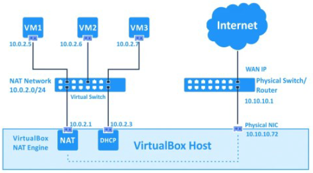
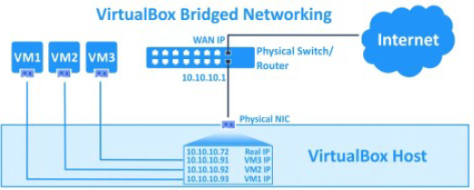
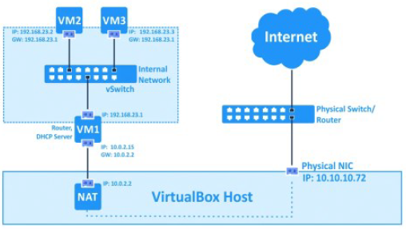
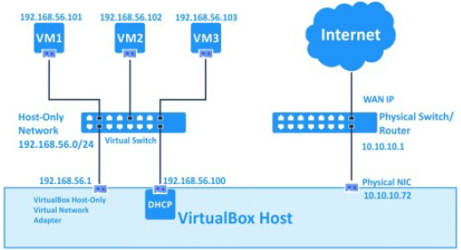
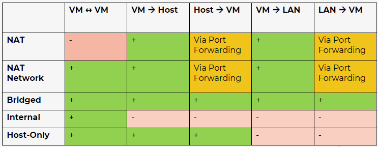

# H2 - Virtual networks

## 2.1. VirtualBox network modes
NAT mode
- Goed voor standalone VM's
- VMS's kunnen niet communiceren
- allemaal IP-adres 10.0.2.15

### NAT
- Default
- VM kan aan toestellen op LAN en WAN
- Host kan niet aan guest, tenzij via port forwarding
- Guest krijgt IP via DHCP: 10.0.2.15, DG is 10.0.2.2/24, onwijzigbaar

### NAT network
- VM kan op internet en aan andere VM's → kan aan LAN en WAN
- Host kan niet aan guest tenzij via port forwarding
- Vergelijkbaar met NAT op router
- Guest krijgt ip via DHCP: 10.0.2.0/24, DG is 10.0.2.1/24, wijzigbaar

Configuratie: File > Preferences > Network

### Bridged adapter
- Bridge op fysieke netwerkinterface
- Meeste mogelijkheden: host kan aan guest, guest kan aan andere guests, kan aan LAN en WAN
- Guest krijgt IP via DHCP netwerk: zelfde range als host

### Internal network
- Geïsoleerd netwerk voor communicatie tussen VMs
- VM kan communiceren met andere VM, maar kan niet aan internet, host kan ook niet aan VM
- Simuleren echt netwerk

### Host-only adapter
- Communicatie tussen host en guests
- VM kan communiceren met andere VMs die verbonden zijn met zelfde netwerk
- VM kan niet aan toestellen op LAN netwerk
- IP-adressen kunnen geconfigureerd worden → DHCP aan of uitzetten

Configuratie: ctrl+H (host network manager)

 
\pagebreak 

### Visualisaties
|Mode|Afbeelding|
|:--|:--|
|NAT||
|NAT network||
|Bridged adapter||
|Internal network||
|Host-only adapter||

### Overzicht

## 2.2. Promiscuous mode

### Filteren van frames
- Standaard: netwerkkaart verwerkt enkel frames geadresseerd aan netwerkkaart
  - (Ethernet) frames: L2 OSI
  - Als bestemmings-MAC = MAC netwerkkaart → verwerkt, anders gedropt
- Sommige netwerkkaarten: promiscuous mode

### Wat is het
- Alle frames verwerkt in deze mode
    - Geen filtering op basis van MAC-adres
    - Alle frames → ook die bedoeld voor ander apparaat in het netwerk
- Wireshark configureert (indien mogelijk) de netwerkkaarten zo (Capture → Options)

### Probleem met switches
- L2 switch: stuurt inkomende frames enkel door op poort waarop doelapparaat aangesloten is
- Lastig om netwerkverkeer af te luisteren: als aangesloten op andere poort
- Poorten configureren als 'mirrored': alle pakketten die binnenkomen verstuurd naar andere switchpoort