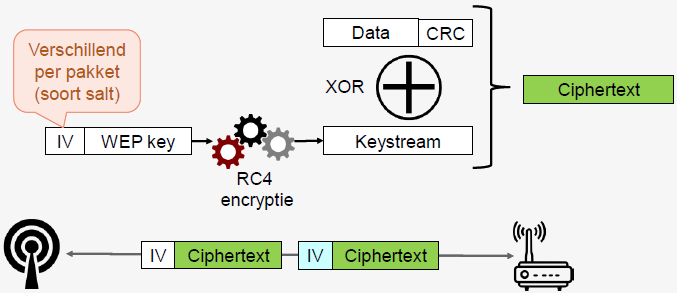

# H3 - Wireless networks

## 3.1. Wi-FI
IEEE 802.11 standaard voor draadloze netwerken
Andere varianten
- 802.11a, 802.11b, 802.11g op 2,4Ghz
- 802.11n (Wifi 4) op 2,4Ghz en 5Ghz
- 802.11ac (Wifi 5) op 5Ghz
- 802.11ax (Wifi 6) op 2,4Ghz en 5Ghz
- Nieuwere varianten hebben meer bandbreedte en hogere snelheid: 802.11 en 802.ax

RC4-encryptie voor beveiliging

### Wireless access point (WAP)
- Toegangspunt voor draadloos netwerk
- Kan 1 of meerdere draadloze netwerken uitzenden
  - ESSID = Extended Service Set Identifier → naam netwerk
  - BSSID = Basic Service Set Identifier → MAC-adres access point
- Draadloze netwerken beveiligd met WEP of WPA(2/3)

### Wireless network interface controller (WNIC)
- Network interface card voor verbinding met draadloos netwerk
- Op laag 1 en 2 van OSI-model
- Kan extern (USB, smartcard), intern (PCI, PCIE), ingebouwd, module op moederbord zijn

## 3.2. Wi-Fi beveiliging

### WEP = Wired Equivalent Privacy
- Encryptie WLAN berichten via RC4
  - Symmetrische encryptie → gedeelde sleutel
- Relatief kleine sleutel: 64bit, later 128bit
- Eerste 24bit is initialisatievector (IV)
  - 64-24 = 40bit (of 10hex)
  - 128-24 = 104bit (of 26hex)

**WEP-encryptie**  

Werking als toestel iets wil verzenden over het draadloze netwerk
- CRC berekenen: fouten opsporen
- Sleutel = IV + wachtwoord → sleutel encrypteren met RC4 algoritme → keystream
- Eenvoudig om XOR te berekenen van keystream en data+crc
- Hieruit komt ciphertext die verstuurd zal worden

**WEP initialisatievector (IV)**
- 24bit = 16.777.216 mogelijke waarden
- Soms herhaling, sommige zijn zwak → onveilig

### WPA = Wi-fi Protected Access
- Opvolger van WEP
- Gebruikt Temporal Key Integrity protocol (TKIP)
- Pakket versleuteld met andere 128bit sleutel → RC4 met IV van 48bit
- Bescherming tegen spoofing via Message Integrity Check
- Thuisnetwerken: in combinatie met 802.1X authenticatieserver of pre-shared key mode (PSK)

### WPS = Wi-fi Protected Setup
- Verbinding maken zonder ingewikkeld wachtwoord
- Via indrukken knop op beide toestellen (Push Button) of PIN (Personal Identification Number)
  - PIN kan gegenereerd worden door client of Wi-Fi router/AP
- Vooral nuttig in thuisnetwerken
- Kwetsbaar voor brute-force aanvallen

## 3.3. Sniffing Wi-Fi

### Wireshark
- Zowel sniffen via draadloos als bekabeld netwerk
- Bij verbinding via WLAN zie je al het verkeer van andere draadloze clients verbonden met zelfde access point → mogelijkheid om te blokkeren (bv Eduroam)
- Ook mogelijk om verkeer te zien van draadloze netwerken waarmee je niet verbonden bent

 
<!--\pagebreak--> 

### Monitor mode
- Radio Frequency MONitor (RFMON) mode
- Soms kan WNIC geconfigureerd worden in deze mode
- Doel: afluisteren alle verkeer op draadloos kanaal (vgl promiscuous mode)
- Kan zonder verbonden te zien met draadloos netwerk
- Enkel passief (luisteren)

### Wi-Fi packet injection
- Data versturen in monitor mode
- Gebruikt voor spoofing van netwerkpakketten die lijken alsof ze onderdeel zijn vh Wi-Fi netwerk
  - Intercept, disrupt, manipulate
- Maakt het makkelijk om Wi-Fi netwerk beveiligd met WEP/WPA te kraken

## 3.4. Cracking Wi-Fi

### Aircrack-ng
- CLI tools om beveiliging Wi-Fi netwerken te testen
- Doeleinden
  - Monitoring - packet capture
  - Attacking - packet injection
  - Testing WNIC capabilities - capture & injection
  - Cracking - WEP, WPA & WPA2
- Origineel voor Linux, nu ook beschikbaar voor andere

**Werkwijze**  
1. Interface configureren in monitor-mode → airmon-ng
2. Reconnaissance: BSSID, ESSID, kanaal → airodump-ng
3. Wi-Fi verkeer afluisteren → airodump-ng
4. (WEP) Wi-Fi verkeer injecteren (sneller veel IVs verzamelen) → aireplay-ng
5. Kraken via verzamelde pakketten → aircrack-ng

### Kraken WEP
- Zwakke IV nodig → veel pakketten
  - Geen probleem op druk Wi-Fi netwerk
- Oplossing: extra verkeer genereren → meer IVs
  - Fake authentication aanval op access point → AP accepteert toekomstige pakketten
  - Heel veel ARP request pakketten spoofen via replay
- Ondertussen: aircrack-ng laten lopen → wachtwoord kraken
  - Probeert automatisch opnieuw na 5000 pakketten

 
<!--\pagebreak--> 

**Aantal pakketten**  
Standaard aanval
- 64bit sleutel: 250.000 IVs
- 128bit sleutel: 1.500.000 IVs

Met PTW aanval
- 64bit sleutel: 20.000 pakketten
- 128bit sleutel: 40.000-85.000 pakketten

Andere aanvallen (FMS/KoreK) ook mogelijk → aircrack combineert technieken

### Kraken WPA
- Als client verbinding maakt: 4way authentication handshake → forceren via deauthentication attack
- Via capture van authentication handshake: WPA wachtwoord kraken via dictionary of brute force (John the Ripper)

**Aantal pakketten**  
- Door 4-way authentication handshake: heel weinig als je kan forceren

### WEP of WPA
- WEP: meer werk om te sniffen, eenvoudig te kraken
- WPA: weinig werk om te sniffen, lastiger te kraken
  - Wordlist nodig (bv RockYou list)
  - Crunch: custom list maken, mogelijkheden (lengte, tekens, ...)
