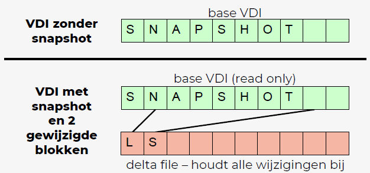

# H4 - Virtual clones

## 4.1. Virtual hardware
- VM = simulatie met virtuele hardware
  - vCPU: via scheduling op fysieke processor (CPUs)
  - vRAM: deel fysiek geheugen
  - vNIC: virtuele netwerkinterface simuleert fysieke netwerkinterface, kan gekoppeld worden aan fysieke netwerkinterface
  - vDISK: virtuele harde schijf is een bestand dat gebruikt wordt als virtueel storage device
- Fysieke hardware kunnen gekoppeld worden aan VM (bv CD, USBs)

### Virtual disk
- Bestand dat virtuele harde schijf voorstelt
  - .vdi: Virtual Disk Image (VirtualBox)
  - .vmdk: Virtual Machine Disk (VMware)
  - .vhd, .vhdx: Virtual Hard Disk (Microsoft)
  - Ander hypervisor-bestand gebruiken is mogelijk, maar meestal minder performant
- Keuze tussen dynamische of statische allocatie
  - Statisch: file size virtual disk = total disk size
  - Dynamisch: file size virtual disk ong= used disk space

### Virtual networks
- VM kan meerdere virtuele netwerkadapters bevatten
  - MAC-adres random gegenereerd en kan gewijzigd worden (in VirtualBox 080027xxxxxx)
- Mogelijk om volledige netwerken te simuleren in software
  - Vgl met pkt
  - VMs die met elkaar kunnen communiceren verbonden via virtueel netwerk
- Virtualisatie van netwerkfuncties (NFV) worden virtuele netwerkfuncties (VNFs) gecombineerd om netwerkdienst aan te bieden
  - Gebruikt met Software Defined Networking (SDN)

## 4.2. Snapshots
- Momentopname huidige staat VM
- Nuttig voor testen → mogelijk om oude staat te herstellen
- Na verwijderen zijn wijzigingen definitief → vrijmaken ruimte & betere performantie VM
- Snapshot van snapshot is mogelijk

### Werking snapshot
- VM bestaat uit minstens 2 bestanden
  - Virtuele harde schijf: naam_disk.vdi
  - Configuratie vd VM: naam_vm.vbox

 
<!--\pagebreak--> 

- Snapshot: 'bevriezen' virtual disk
  - VDI read only
  - Wijzigingen bijgehouden in delta file
- Kopie gemaakt van configuratiebestand

**Werking delta file**  

- Harde schijf bestaat uit verschillende blokken, die elk een vaste hoeveelheid data bevatten
- VDI stelt harde schijf voor, te beschouwen als een array van blokken
- Bij snapshot bevriezen we harde schijf in read only, en houden de wijzigingen bij in delta file
  - Delta file bevat een lijst van tupels (bestaan uit referentie naar het gewijzigde blok en de nieuwe waarde voor dat blok)

### Overhead snapshot
- Extra schijfruimte: elk gewijzigd blok neemt 2 blokken in op harde schijf host
- Schijfoperaties worden ingewikkelder: mengen van delta file met base VDI
- Snapshots van snapshots creëeren extra overhead

Daarom: snapshots handig voor testen, minder geschikt als backup

### Beheer snapshots (VirtualBox)
- Take: aanmaken met evt naam en omschrijving
- Restore: alle wijzigingen sinds aanmaken snapshot ongedaan maken
- Delete: merge van base file met delta file → wijzigingen worden permanent

## 4.3. Een VM klonen
- Nood aan gelijkaardige VMs: zelfde OS, SW, ...
- Elke VM vanaf scratch aanmaken: onnodig veel werk
  - Alternatieven: uitrollen via automatische boot omgeving, bv PXE boot, bestaande image gebruiken als basis voor VM, kloon maken van VM
- Bij kopie: instellen wat gekopieerd moet worden (vRAM, CPUs, ..) en wat gewijzigd moet worden
- Voor vDISK: keuze tussen volledig of gelinkt
  - Volledig: volledige kopie vDISK voor nieuwe VM
  - Gelinkt: nieuwe VM deelt vDISK met originele VM maar houdt wijzigingen incrementeel bij (delta file bij snapshots)

**In VirtualBox**: keuze tussen 'guided mode' en 'expert mode'
