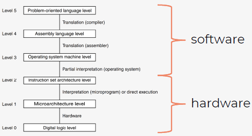

# H5 - Static file analysis

## 5.1. Recap process vs file

### From binary to process
Programma = uitvoerbaar bestand opgeslagen op harde schijf van toestel
- Typisch een binary
- Bevat instructies en statische data
- Bij openen programma: proces aanmaken, data & instructie verplaatst naar werkgeheugen toestel, ruimte voorzien op heap en stack


### Compilation
- Programmeertaal moet gecompileerd worden voor CPU

  

Van code naar hex: programma → assembler → binaire code  

### Process vs file
Process: runt altijd op memory en staat in bepaalde staat   (new - ready - running - waiting - terminated)  
File/binary/executable: stored op disk en runt niet

<div style="page-break-after: always; visibility: hidden"> 
<!--\pagebreak--> 
</div>

### Analyzing processes (aka Dynamic)
Om processen te analyseren moeten we: OS analyseren, sandboxes gebruiken, debugger aan proces hangen

**Proces explorer (Windows)**  
- From sysinternals suite
- Uitgebreide task manager
- Tree view voor processen
  - Lichtgroen: proces net gestart
  - Rood: proces stopt

### Analyzing files (aka Static)
Om files te analyseren: enkel file access nodig → veilig: er moet niks runnen  
- Simple static: makkelijker omdat enkel de bytes geanalyseerd worden en geïnterpreteerd
- Advanced static: disassembler die file omzet in assembly language

## 5.2. Terminology

### Debugging
- Typisch gebruikt door developers om bugs of onverwacht gedrag te zoeken/begrijpen
- Van malware-analyse-point-of-view: zoveel mogelijk debug-info verzamelen
- Debugger: attached to a process (inspecteert variabelen, registry-waarden, instructies, ..)

### Managed vs unmanaged code
Managed: gecompileerde vode moet nog eens uitgevoerd worden in specifieke runtime omgeving  
bv. JVM van Java, .NET bij C#  
  

Unmanaged: direct een gecompileerde machinecode versie, moeilijker terug te keren naar broncode  
bv. C, C++  

### Disassembling
Machine byte code interpreteren in assembleertaal om meer inzicht te krijgen in het programma → verschilt per CPU architectuur (ARM, x86)  
  

## 5.3. Intro malware analysis

### Malware
- Malware 'does' something (or wants to do something at a certain point)  
  - Trojans, worms, ransomware, spyware/adware
- Malware die gewoon 'statisch' op pc staat, kan relatief veilig zijn
  - Daarom virus in quarantaine steken
- Eenvoudigste vorm: achterhalen hoe files te analyseren zonder ze uit te voeren

VirusTotal: scant websites/bestanden  

## 5.4. Analyzing files

### File hashes
Windows: ```Get-FileHash -Algorithm SHA256 .\bestand.svg```  
Linux: ```sha256sum bestand.svg```  

Hashing = wiskundige techniek om gegeven inputstream aan data (bytes) een hash te berekenen  

### Strings
Linux: ```strings /usr/bin/ipcalc | head -25```  

Doet poging om alle tekst (ASCII) uit een bestand te interpreteren en te tonen, zelfde als zelf zoeken tussen tekens in (bv) Notepad, maar dan opgeruimd  

### xxd/hexdump
Linux
```xxd /usr/bin/ipcalc | head```  
```hexdump -C bestand.svg | head```  

Geven inhoud van bestand weer als hexadecimale getallen

### 'Magic bytes' or 'file signatures'
Meeste bestanden: vaste start → header → toont type bestand  
Linux: header gebruikt om te bepalen welk programma te gebruiken
Windows: gebruikt extensie om te bepalen welk programma → extensie aanpassen wijzigt inhoud vd file niet!  