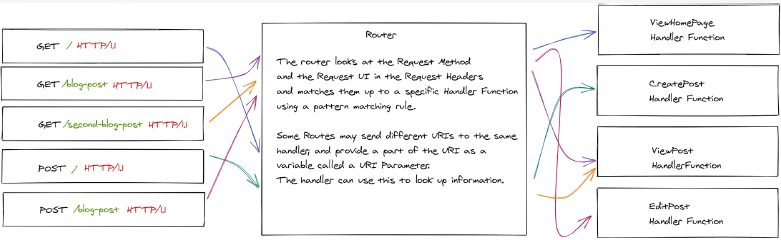
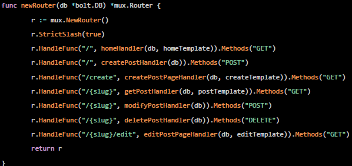
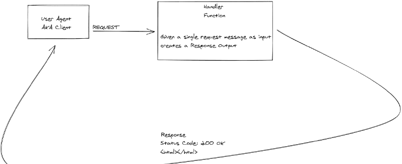
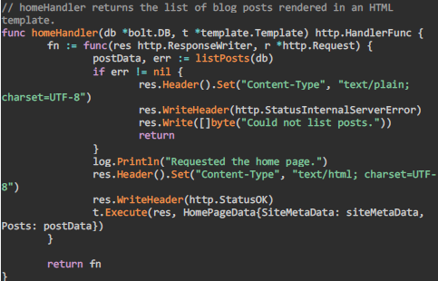
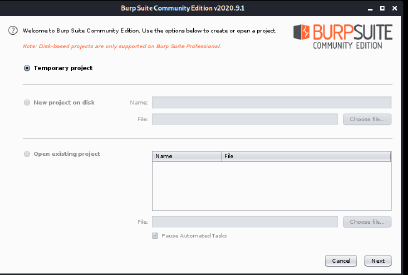
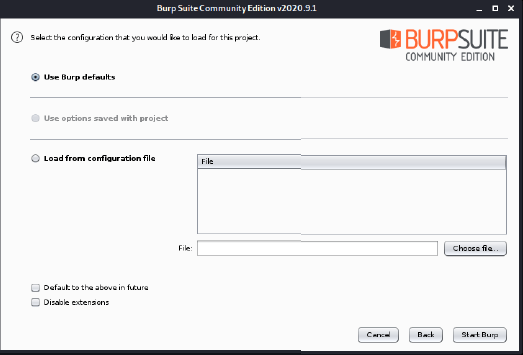
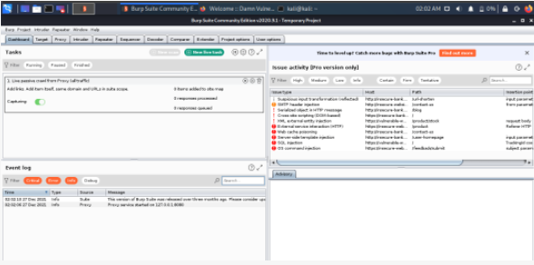
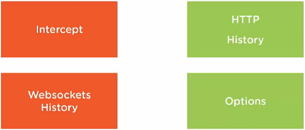

# H7 - burp suite

## 7.1. Web application anatomy

Web applications
- Verschillende talen, maar sommige dingen zijn universeel
- Doordat web applicatie vaak common is: goed startpunt voor een penetration test

Web server and web client
- Server: runt op machine gecontroleerd door web app creator
- Client: runt op machine gecontroleerd door een user of de webapplicatie (laptop, desktop, ..)

HTTP standard
- Request en response messages: bepalen welke taal te spreken → HTTP standard
- Set regels voor structuur van berichten

### The request
- Gemaakt door client, verzonden naar server
- 2 belangrijke delen: headers en (opt) body
  - Headers: key-value pairs die common algemene info bevatten
  - Body: verschillende types info

Opbouw request
- Voorbeeld: GET /any-path/can-go-here HTTP/1.1
- GET: request method → vertelt aan server wat er moet gebeuren
  - 9 opties: GET, HEAD, POST, PUT, DELETE, CONNECT, OPTIONS, TRACE, PATCH
- /any-path/...: request URI (Uniform Resource Identifier) or path → vertellen server wat client wil
- HTTP/1.1: HTTP version → vertelt server met welke versie van HTTP client verzendt

Request body
- Optioneel
- Kan geformatteerd worden op verschillende manieren, maar meestal als JSON string
- Kan info over author, post, ... bevatten

### The web server

Als client request message verzendt naar server: server parst naar te verstaan object (afbeelding)  
- Als server request niet kan verstaan: returnt 'special error' naar client
- Als server request kan verstaan: regels toepassen om te bepalen wat te doen met request → 'routing' genoemd

### Request routing
- Basis: elk gegeven request koppellen aan een handler function → gedaan door lijst van regels: 'routes'
- Meest common patterns om te matchen: URI gecombineerd met HTTP method

Notes on routes
- Routes kunnen elke variabele catchen gegeven door de handler, curly braces matchen alles en storen die variabele
- Eenzelfde URI kan verschillende handlers hebben voor verschillende HTTP methods; opvallende: homeHandler (get requests naar home page), createPostHandlet (post requests naar zelfde pad)

Voorbeeld voor blog application  

Router creëert 4 web page routes die HTML-pagina's teruggeven
- Home page: GET naar / → homeHandler
- Post detail page: GET naar /anything-goes-here → getPostHandler
- Create post form page: GET naar /create → createPostPageHandler
- Edit post page: GET naar /anything-goes-here/edit → editPostPageHandler

3 eindpunten die JSON als request body neemt en data verandert
- Create post endpoint: POST naar / → createPostHandler
- Edit post endpoint: POST naar /anything-can-go-here → modifyPostHandler
- Delete post endpoint: DELETE naar /anything-can-go-here → deletePostHandler

### Request handler functions

- Als web server request heeft gematcht met een functie: routen langs die functie
- Function moet request krijgen en een antwoord maken voor de client

Voorbeeld: handler die een lijst van posts in een database kan bereiken en goed geformatteerde response kan maken met ContentType html en body die html bevat (Content-type: HTML webpagina, Status code die client zegt of request succesvol was)   

Meestvoorkomende HTTP status codes
- 200: standaard OK
- 201: OK en nieuwe resource aangemaakt
- 204: OK en geen info teruggegeven
- 304: gebruikt voor browser caching
- 400: server kan request niet verstaan door client error
- 401: als authenticatie nodig is, maar faalt
- 403: valid request, maar server weigert het
- 404: most common, request is valid, resource kan niet gevonden worden
- 409: request conflicts met current state vd bron
- 410: gevraagde resources zijn niet meer beschikbaar
- 500: als server request niet kan uitvoeren door unexpected issue

## 7.2. Burp suite

Wat?
- Proxy tool
- Intercept, analyze en modify requests
- Populair onder security researchers, CTF players, bug bounty hunters

Waarom burp?
- Niet alleen proxy tool, ook master framework (web spidering, automated/manual testing of web applications, web application analysis, identification of vulnerabilities)
- Inbuild chromium browser
- Gratis beschikbaar, maar ook professionele (betalende) versie

Getting started
- Op Kali: pre-installed

 
<!--\pagebreak--> 

### Instellingen om ermee te werken
1. Window met opties: kies 'temporary project' en next
2. Default options houden
3. Launched burp suite

||||
|:--|:--|:--|

### (Intercepting) proxy
- Pentesters gebruiken dit om traffic te onderscheppen tussen web browser en web application
- Pentesters observeren (unexpected) gedrag van web application

Proxy traffic
- Browser: local proxy setting 127.0.0.1:8080
- Burp suite proxy: HTTP en HTTPS verkeer passeert hier
- Web applicatie: target

### Configure burp suite proxy
1. Installeren browser extensie 'foxy proxy'
2. In browser, extensie openen, 'options', 'add'
3. In pop-up title, proxy type, proxy IP-adres en port invullen
4. Activeren suite: in extensie juiste add-on selecteren
5. Als juiste config: error bij zoeken naar bv 'www.google.be'
6. Oplossing: CA certificate downloaden
7. Naar http://burpsuite, CA certificate downloaden
8. In settings, CA certificate importeren
9. In certificate manager, certificaat aangeven als vetrouwd, beide opties aanduiden
10. Burp suite testen, 'www.google.com' opzoeken, als het werkt geen probleem

### Use burp suite
Tools om requests te manipuleren
- Target: overzicht van target content en functionaliteit
- Proxy: intercept/view/modify requests/responses
- Spider: automatisch web applicatie crawlen
- Repeater: alter/reissue HTTP queries om applicatie-antwoorden te analyseren

 
<!--\pagebreak--> 

### Burp proxy tabs

Intercept: aan/uitknop om interception aan/uit te schakelen
HTTP history: capturet requests/responses in indexed format
Websockets history: helpt om web thread/worker communicatie te onderscheppen
Options: proxy settings customizen, bv instellen op welke poort burp moet luisteren

### Burp message editor
- Laat toe om RAW data van request te bekijken
